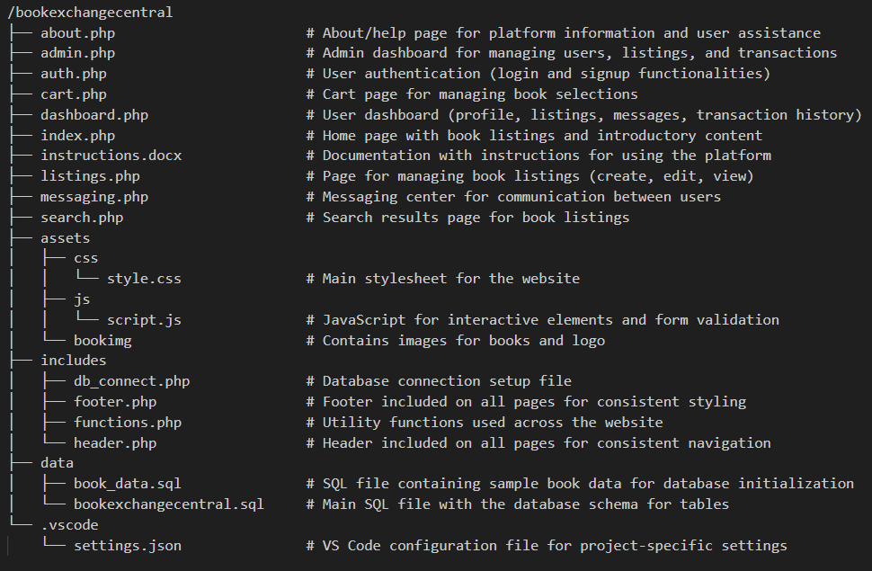

# BookExchangeCentral

BookExchangeCentral is a web-based platform for university students to buy and sell used textbooks.

## Features

User registration and login  
Book listings (create, edit, delete)  
Search for books  
User-to-user messaging  
Admin dashboard for managing users and listings  
Technologies Used  
HTML5, CSS3, JavaScript  
PHP for server-side processing  
MySQL for database  
JS for dynamic content loading  

## File Structure

## Installation

### Clone the repository:

git clone https://github.com/sandeshchhetri985016/BookExchangeCentral.git
Set up a local server (wampserver), and move the project to the www folder.

Create a MySQL database named book_exchange and import the bookexchangecentral.sql file using phpMyAdmin.

Start your local server and visit http://localhost/BookExchangeCentral/.

## License

This project is open source software.

